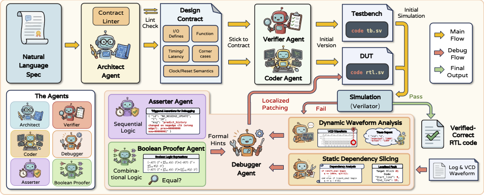

# Veri-Sure: Contract-Aware RTL Code Generation Agents with Temporal Tracing, Slicing and Formal Verification



## Overview

**Veri-Sure** is a state-of-the-art multi-agent framework that combines trace-based verification and formal methods to generate correct RTL code.

### Key Features

- **🏆 State-of-the-Art Performance**: Achieves 93.30% functional correctness on VerilogEval-v2-EXT (Global #1).
- **🤖 Multi-Agent Architecture**: Six specilized agents for different purposes.
- **🔍 Dual Verification**: Combines simulation-based trace analysis with formal verification (assertion and boolean proof).
- **📝 Contract-Aware**: Leverages design contracts for correct implementations.
- **🔄 Iterative Refinement**: Automated debugging and fixing based on verification feedback

## VerilogEval-v2-EXT Benchmark

### **Leaderboard on VerilogEval-v2-EXT @ Pass 1 (%).**

**Rankings**: 🥇 Global 1st, 🥈 Global 2nd, 🥉 Global 3rd (best performance across all methods). 👍 Group Best (if not in global top-3).

**Badges**: 🏆 Best Open-Source (top open-weights model), 🚀 High Potential (largest relative gain with agents), ⚡️ Efficiency King (best performance-to-parameter ratio), 🧠 Reasoning Expert (best on Hard subset), 💪 Robust Performer (minimal gap between Syntax and Functional scores).

| Method | Params | Easy (n=51)<br>Syn. / Func. | Medium (n=91)<br>Syn. / Func. | Hard (n=67)<br>Syn. / Func. | Overall<br>Syn. / Func. |
|--------|--------|-----------------------------|-----------------------------|---------------------------|------------------------|
| **Standalone LLMs** ||||||
| GPT-5.2 | - | 🥇 100.00 / 🥉 94.12 | 🥇 100.00 / 79.12 | 🥇 100.00 / 59.70 | 🥇 100.00 / 76.56 |
| Claude-4.5-Sonnet | - | 🥇 100.00 / 90.20 | 🥇 100.00 / 74.73 | 🥉 97.01 / 53.73 | 🥉 99.04 / 71.77 |
| Gemini-3-Pro 🧠 | - | 🥇 100.00 / 🥉 94.12 | 🥇 100.00 / 👍 85.71 | 🥇 100.00 / 👍 62.69 | 🥇 100.00 / 👍 80.38 |
| Qwen3-Max | - | 🥉 96.08 / 86.27 | 93.41 / 54.95 | 86.57 / 37.31 | 91.87 / 56.94 |
| Mistral-Medium-3.1 | - | 🥇 100.00 / 78.43 | 87.91 / 52.75 | 77.61 / 19.40 | 87.56 / 48.33 |
| DeepSeek-3.2 | 685B (37B) | 🥉 96.08 / 80.39 | 96.70 / 64.84 | 85.07 / 41.79 | 92.82 / 61.24 |
| Qwen3-Coder-Plus | 480B (35B) | 92.16 / 80.39 | 91.21 / 60.44 | 77.61 / 29.85 | 87.08 / 55.50 |
| LLaMA-4-Maverick | 402B (17B) | 🥇 100.00 / 86.27 | 85.71 / 53.85 | 76.12 / 32.84 | 86.12 / 55.02 |
| GLM-4.7 🏆 💪 | 358B (32B) | 🥉 96.08 / 90.20 | 86.81 / 70.33 | 71.64 / 44.78 | 84.21 / 66.99 |
| Devstral-2 | 123B | 🥈 98.04 / 80.39 | 91.21 / 58.24 | 67.16 / 25.37 | 85.17 / 53.11 |
| Mistral-3-14B 🚀 | 14B | 94.12 / 70.59 | 71.43 / 29.67 | 55.22 / 11.94 | 71.77 / 33.97 |
| QiMeng-SALV | 7B | 🥉 96.08 / 66.67 | 95.60 / 53.85 | 88.06 / 22.39 | 93.30 / 46.89 |
| RTL-Coder | 6.7B | 94.12 / 64.71 | 83.52 / 29.67 | 65.67 / 5.97 | 80.38 / 30.62 |
| CodeV-R1 ⚡️ | 7B | 88.24 / 74.51 | 92.31 / 54.95 | 64.18 / 23.88 | 82.30 / 49.76 |
| VeriLogos | 7B | 86.27 / 49.02 | 90.11 / 26.37 | 71.64 / 1.49 | 83.25 / 23.92 |
| **Single Agent Systems** (w. Simulator Feedback & Iterative Fix) ||||||
| w. GPT-5.2 | - | 🥇 100.00 / 🥈 96.08 | 🥇 100.00 / 81.32 | 🥇 100.00 / 59.70 | 🥇 100.00 / 77.99 |
| w. Gemini-3-Pro | - | 🥇 100.00 / 🥈 96.08 | 🥇 100.00 / 🥉 86.81 | 🥇 100.00 / 🥉 70.15 | 🥇 100.00 / 👍 83.73 |
| w. Qwen3-Max | - | 🥇 100.00 / 🥉 94.12 | 92.31 / 68.13 | 89.55 / 44.78 | 93.30 / 66.99 |
| w. Mistral-Medium-3.1 | - | 🥈 98.04 / 78.43 | 95.60 / 56.04 | 89.55 / 31.34 | 94.26 / 53.59 |
| w. DeepSeek-3.2 | 685B (37B) | 🥇 100.00 / 84.31 | 🥉 97.80 / 67.03 | 94.03 / 44.78 | 97.13 / 64.11 |
| w. Qwen3-Coder-Plus | 480B (35B) | 🥈 98.04 / 80.39 | 93.41 / 63.74 | 88.06 / 31.34 | 92.82 / 57.42 |
| w. LLaMA-4-Maverick | 402B (17B) | 🥇 100.00 / 92.16 | 91.21 / 59.34 | 79.10 / 32.84 | 89.47 / 58.85 |
| w. GLM-4.7 | 358B (32B) | 🥈 98.04 / 🥉 94.12 | 96.70 / 81.32 | 92.54 / 58.21 | 95.69 / 77.03 |
| w. Devstral-2 | 123B | 🥇 100.00 / 78.43 | 94.51 / 57.14 | 88.06 / 34.33 | 93.78 / 55.02 |
| w. Mistral-3-14B | 14B | 94.12 / 76.47 | 79.12 / 48.35 | 55.22 / 19.40 | 75.12 / 45.93 |
| w. QiMeng-SALV | 7B | 🥈 98.04 / 74.51 | 94.51 / 51.65 | 88.06 / 17.91 | 93.30 / 46.41 |
| w. RTL-Coder | 6.7B | 84.31 / 56.86 | 80.22 / 38.46 | 70.15 / 8.96 | 77.99 / 33.49 |
| w. CodeV-R1 | 7B | 🥈 98.04 / 84.31 | 🥉 97.80 / 61.54 | 85.07 / 32.84 | 93.78 / 57.89 |
| w. VeriLogos | 7B | 🥉 96.08 / 56.86 | 86.81 / 24.18 | 82.09 / 4.48 | 87.56 / 25.84 |
| **Multi Agents Systems** ||||||
| MAGE (w. GPT-5.2) | - | 🥇 100.00 / 🥈 96.08 | 🥇 100.00 / 🥇 95.60 | 🥈 98.51 / 🥈 77.61 | 🥈 99.52 / 🥈 89.95 |
| VerilogCoder (w. GPT-5.2) | - | 🥇 100.00 / 🥉 94.12 | 🥇 100.00 / 🥈 90.11 | 🥇 100.00 / 68.66 | 🥇 100.00 / 🥉 84.21 |
| Veri-Sure (w. DeepSeek-3.2) | 685B (37B) | 🥇 100.00 / 90.20 | 🥈 98.90 / 73.63 | 🥉 97.01 / 53.73 | 98.56 / 71.29 |
| **Veri-Sure (w. GPT-5.2)** | - | 🥇 **100.00** / 🥇 **100.00** | 🥇 **100.00** / 🥇 **95.60** | 🥇 **100.00** / 🥇 **85.07** | 🥇 **100.00** / 🥇 **93.30** |


## Quick Start

### Environment Setup

#### 1) Conda Environment

```bash
conda create -n veri-sure python=3.10 -y
conda activate veri-sure
```

#### 2) Python Dependencies

```bash
pip install -r requirements.txt
```

#### 3) Install Verilator and SymbiYosys

Verilator is a free and open-source tool that converts Verilog code into C++ or SystemC code for simulation. SymbiYosys (sby) is a front-end for formal verification using Yosys and various back-end solvers.

Please refer to: [https://github.com/verilator/verilator](https://github.com/verilator/verilator) and [https://github.com/YosysHQ/sby](https://github.com/YosysHQ/sby).

Verify:

```bash
verilator --version
sby --version
```

#### 4) Configure OpenAI Endpoint

```bash
export OPENAI_API_KEY="..."
```

Optionally, set custom endpoint and model:

```bash
export OPENAI_BASE_URL="https://api.openai.com/v1"
export OPENAI_MODEL="gpt-5.2"
```

### Running (prompted)

```bash
python -m eda_agent run \
  --prompt "Implement a 4-bit adder with inputs a[3:0], b[3:0], and output sum[4:0]" \
  --stream \
  --temperature 0 \
  --top-p 1 \
  --sim-max-retry 4 \
  --max-completion-tokens 2000
```

The full set of arguments can be found via `python -m eda_agent run --help`.

Output will be written to `runs/` (each run creates a directory containing `rtl.sv` / `tb.sv` / logs, etc.).

### Evaluate on the VerilogEval-v2-EXT Benchmark

```bash
python benchmarks/run_verilog_eval_v2.py \
  --samples 1 \
  --stream
```

**⚠️ Cost Warning**: A full benchmark evaluation costs approximately **$80-$200** depending on the number of retries and tool calls required. Please monitor your API usage carefully.

## License

MIT License.